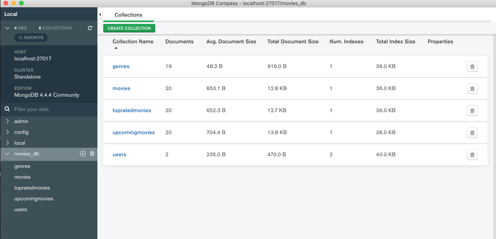

# Assignment 2 - Film Finder API.
​
Name: Eoin Hearne
​
## Overview
​
This API is based on the [TMDB API](https://developers.themoviedb.org/3/getting-started/introduction). The data used is taken from the website but uses it's own endpoints. It has been develeoped for use by the [Film Finder](https://github.com/ojoesuff/movies_online) application.

## API Configuration
As the ```.env``` is not included, please add one in the root directory with the below configuration, replacing the secret for the JWT token with your own phrase.
​
```bat
NODE_ENV=development
PORT=8080
HOST=localhost
mongoDB=mongodb+srv://....
mongoDB=mongodb://localhost:27017/movies_db
seedDb=true
secret=YourJWTSecret
```
​
## Installation Requirements
​
To start the API, clone this repo. You will also need MongoDB installed.

Once the repo is downloaded run the below command to install all the necessary packages.
​
```bat
npm install
```

To start the MongoDB server, run:
​
```bat
mongod --dbpath ./db/
```

Once the mongo server is running, run: 
​
```bat
npm start
```
​
## API Design

The API was deigned using Swagger. To documentation can be viewed [here](http://localhost:8080/api/docs/) once the server is running or alternatively can be viewed on the [Swagger website](https://app.swaggerhub.com/apis/eoin-hearne/MovieAPI/1.0#free).

The main API endpoints are:

1. ```movies``` - Used to gather movies based on the TMDB API.
2. ```genres``` - Used to gather genres based on the TMDB API.
3. ```users``` - Authenticates and registers users.
​
responses
seedData

## Security and Authentication
​
For authenication, the ```api/users``` endpoint is used. Any calls will be made using the users password and unique username. The API stores the password in the database as a encrypted hash. When the users attempts to login, the useranem and passwrd is sent to the API, which decrypts the users passwrd to check validity. 

When a user registers, the username is checked in the API to see if it already exists in the database.
​
### Data Design


​
Mongo DB is used with Express to query and manage data in the database. ​As seen in the above screen shot of Mongo DBs database manager, Compass, there are 5 database collections.

- Genres
- Users
- Movies
    - Discover Movies
    - Top Rated Movies
    - Upcoming Movies

Each movie contains details of the movie and user reviews, which are added through the API.
Each user contains a list of favourite movies and wishlists, which also contain movie references.
​
## Integrating with React App
​
Describe how you integrated your React app with the API. Perhaps link to the React App repo and give an example of an API call from React App. For example: 
​
~~~Javascript
export const getMovies = () => {
  return fetch(
     '/api/movies',{headers: {
       'Authorization': window.localStorage.getItem('token')
    }
  }
  )
    .then(res => res.json())
    .then(json => {return json.results;});
};
​
~~~
​
## Extra features
​
. . Briefly explain any non-standard features, functional or non-functional (e.g. user registration, authentication) developed for the app  
